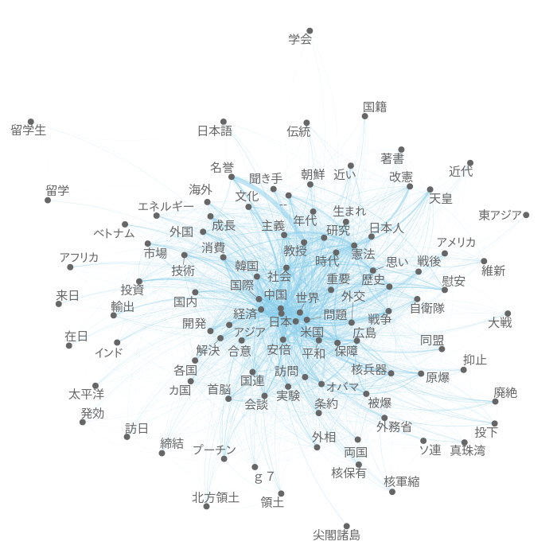

より高度な分析
==============

**dfm**は、ほかのRのパッケージと互換性があるため、**quanteda**をテキストデータの前処理に用いて、さまざまな統計分析を行うことができる。

準備
----

``` r
require(quanteda) # パッケージの読み込み
```

``` r
load('data/data_corpus_asahi_2016_seg.RData')

# 文書行列を作成
#toks <- tokens(data_corpus_asahi_2016, remove_punct = TRUE)
toks <- tokens(data_corpus_asahi_2016_seg, what = "fastestword", remove_punct = FALSE)
mx <- dfm(toks)
mx <- dfm_select(mx, min_nchar = 2) # 一文字語を削除
mx <- dfm_remove(mx, '^[ぁ-ん]+$', valuetype = 'regex') # ひらがなを削除
mx <- dfm_trim(mx, min_count = 5) # 低頻度語を削除
nfeature(mx)
```

    ## [1] 30216

分析
----

### 共起ネットワーク分析

`fcm`によって文書内での語の共起関係についての行列を作成し、共起ネットワーク分析（意味ネットワーク分析）を行える。ネットワークの視覚化には**igraph**などの専門パッケージを利用する。

``` r
require(igraph)
```

``` r
# 日本が言及されている記事と言及されていない記事を比較
key_jp <- rownames(textstat_keyness(mx, which(rowSums(dfm_select(mx, '日本')) > 0))) 

mx_top <- mx[,head(key_jp, 20)] # 日本と最も強く関連する20語を選択
mx_col <- fcm(mx_top, tri = FALSE) # 共起行列を作成
mx_nor <- dfm_weight(mx_col, 'relFreq') # 共起頻度を標準化
```

``` r
gr <- graph_from_adjacency_matrix(mx_nor, weighted = TRUE, diag = FALSE) # グラフオブジェクトを作成
igraph.options(plot.layout=layout_with_graphopt, vertex.label.family = 'sanserif', vertex.label.cex = 0.8)
plot(gr, edge.width = E(gr)$weight * 20,  edge.arrow.size = 0.5, vertex.size = 20)
```


