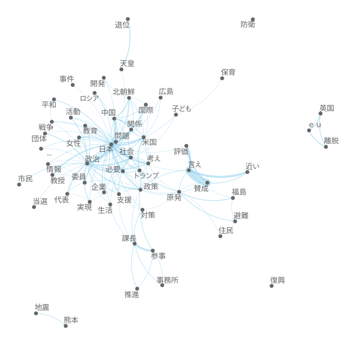

より高度な分析
==============

**dfm**は、ほかのRパッケージと互換性があるため、**quanteda**をテキストデータの前処理に用いて、さまざまな統計分析を行うことができる。

準備
----

``` r
require(quanteda) # パッケージの読み込み
```

``` r
load('data/data_corpus_asahi_2016_seg.rda')

# 文書行列を作成
toks <- tokens(data_corpus_asahi_2016_seg, what = "fastestword", remove_punct = TRUE)
mx <- dfm(toks)
mx <- dfm_select(mx, min_nchar = 2) # 一文字語を削除
mx <- dfm_remove(mx, '^[ぁ-ん]+$', valuetype = 'regex') # ひらがなを削除
mx <- dfm_trim(mx, min_count = 5) # 低頻度語を削除
nfeature(mx)
```

    ## [1] 30165

分析
----

### 共起ネットワーク分析

`fcm`によって文書内での語の共起関係についての行列を作成し、`textplot_network()`を用いると意味ネットワーク分析を非常に簡単に行える。

``` r
mx_col <- fcm(mx) # 共起行列を作成
feat <- names(topfeatures(mx_col, 100)) # 最も頻度が高い共起語を選択
mx_col <- fcm_select(mx_col, feat)
textplot_network(mx_col, min_freq = 0.95, edge_size = 5)
```


