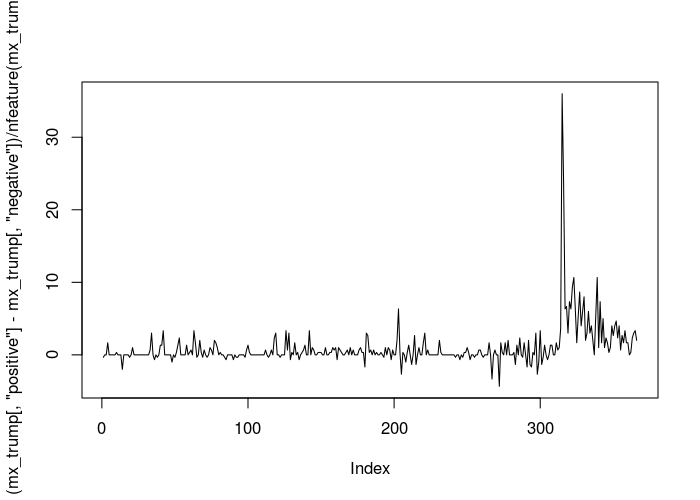
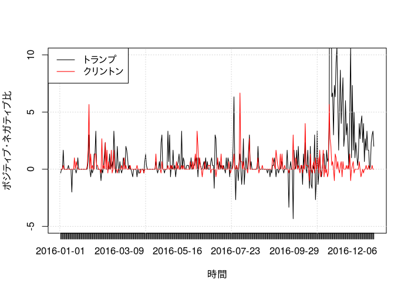

dfm
===

**dfm**（document-feature matrix）は、行が文書で列が語を表す行列である。調査データなどと比較して、テキストデータは変数の数が多くなるため、**dfm**を作成した後に`dfm_select()`や`dfm_trim()`などを用いて、語の長さや頻度に基づいた特長語の選択を行うと、期待した分析結果を得られることが多い。

作成
----

``` r
require(quanteda) # パッケージの読み込み
```

``` r
load('data/data_corpus_asahi_2016.rda')

# 文書行列を作成
toks <- tokens(data_corpus_asahi_2016, remove_punct = TRUE)
mx <- dfm(toks)
nfeature(mx)
```

    ## [1] 69550

``` r
topfeatures(mx)
```

    ##     の     を     に     は     が     た     と     で     て   した 
    ## 535473 333250 282844 259779 255923 173693 170981 140091  90675  83094

操作
----

``` r
# 一文字語を削除
mx <- dfm_select(mx, min_nchar = 2)

# ひらがなを削除
mx <- dfm_remove(mx, '^[ぁ-ん]+$', valuetype = 'regex')

# 低頻度語を削除
mx <- dfm_trim(mx, min_count = 5)
nfeature(mx)
```

    ## [1] 27476

``` r
topfeatures(mx, 100)
```

    ##     日本     政府     政治     選挙     問題     経済     説明     投票 
    ##    20977    17543    16199    14754    11107    10999     9928     9554 
    ##     社会     首相     憲法     政権     東京     中国     考え     関係 
    ##     9079     9065     8841     8236     8227     8211     8148     8005 
    ##     政策   大統領     必要     写真     参院     議員     受け     国民 
    ##     7491     7406     7342     7339     7208     7170     7059     7051 
    ##     米国     世界     支援     安倍     反対     委員     原発     昨年 
    ##     6897     6683     6514     6455     6441     6045     5707     5674 
    ##     代表     女性     活動     支持     企業     国際     以上     参加 
    ##     5599     5548     5502     5490     5454     5286     5257     5254 
    ##     地域     会議     自分     思い     調査     向け     国会     市民 
    ##     5225     5088     5023     4955     4921     4917     4912     4878 
    ##     団体     多く     知事     安全     大学     求め     対策     今回 
    ##     4856     4767     4692     4673     4583     4579     4534     4505 
    ##     訴え   北朝鮮     野党   自民党     批判     指摘     民進     情報 
    ##     4440     4415     4370     4294     4280     4251     4235     4231 
    ##     議論     教授     改正     保障 トランプ     教育     一方     実現 
    ##     4228     4227     4191     4164     4149     4062     4014     4008 
    ##     韓国     生活     時間     沖縄     示し     市長     候補     時代 
    ##     3986     3915     3908     3893     3882     3856     3843     3805 
    ##     記者     意見     話す     戦争     思う     平和   子ども     制度 
    ##     3801     3788     3740     3693     3661     3653     3637     3614 
    ##     事業     共産     労働     賛成     発表     判断     地方     対応 
    ##     3596     3570     3565     3552     3550     3544     3530     3490 
    ##     会長     会見     計画   可能性 
    ##     3471     3457     3443     3399

分析
----

**dfm**は文字の文書内での位置を保持しないためいわゆるbag-of-wordsによるアプローチで、Rの一般線形モデルや主成分分析などを適用できるが、**quanteda**は、文書に特化した分析機能（`teststat_*()`）を複数含んでいる。

### 相対頻度分析

`teststat_keyness()`は二つの文書のグループを比較し、頻度が特別に高い（もしくは低い）語を抽出する。

``` r
# 社会面の特徴語抽出
keys <- textstat_keyness(mx, docvars(mx, 'section') == '１社会' | docvars(mx, 'section') == '２社会')
head(keys, 20)
```

    ##             chi2 p n_target n_reference
    ## 沖縄   1324.3181 0      947        2946
    ## 名古屋 1315.6112 0      415         654
    ## 田母神 1265.6158 0      129          14
    ## 被爆   1052.5231 0      485        1091
    ## 小池    880.3549 0      333         629
    ## 大阪    848.4553 0      729        2541
    ## 舛添    845.4275 0      343         691
    ## 愛知    835.5536 0      283         480
    ## 東京    735.2793 0     1357        6870
    ## 都議会  671.6090 0      174         219
    ## 米兵    653.2712 0      156         177
    ## 都知事  649.3363 0      244         458
    ## 河村    615.7512 0      132         129
    ## 基地    583.9567 0      457        1505
    ## 都議    559.4532 0      143         177
    ## 福岡    550.7467 0      365        1079
    ## 参照    536.1756 0      261         614
    ## 三笠    493.0476 0       63          21
    ## ｕｒ    491.8973 0       99          88
    ## 被害    467.5468 0      529        2145

### 辞書分析

基本的な手順では**dfm**上で辞書分析を行うために**dfm**を作成してから`dfm_lookup()`を用いるが、`dfm()`の`dictionary`引数に辞書を渡すことで、直接辞書分析の結果を得ることができる。

``` r
# 感情分析辞書（Higashiyama et al. 2008) の読み込み
dict <- dictionary(file = 'extra/higashiyama_sentiment.yml')

date <- seq(as.Date('2016-01-01'), as.Date('2016-12-31'), by = '1 day') # すべての日にちを生成
```

``` r
toks_trump <- tokens_select(toks, "トランプ", window = 5)
mx_trump <- dfm(toks_trump)
mx_trump <- dfm_lookup(mx_trump, dictionary = dict, nomatch = 'none')
mx_trump <- dfm_group(mx_trump, factor(docvars(mx_trump, 'date'), levels = as.factor(date)), fill = TRUE) # 日ごとに集計
mx_trump <- mx_trump[order(docnames(mx_trump)),] # 日にちで並べ替え
plot((mx_trump[,'positive'] - mx_trump[,'negative']) / nfeature(mx_trump), type = 'l')
```



``` r
toks_clinton <- tokens_select(toks, "クリントン", window = 5)
mx_clinton <- dfm(toks_clinton)
mx_clinton <- dfm_lookup(mx_clinton, dictionary = dict, nomatch = 'none')
mx_clinton <- dfm_group(mx_clinton, factor(docvars(mx_clinton, 'date'), levels = as.factor(date)), fill = TRUE) # 日ごとに集計
mx_clinton <- mx_clinton[order(docnames(mx_clinton)),] # 日にちで並べ替え
plot((mx_clinton[,'positive'] - mx_clinton[,'negative']) / nfeature(mx_clinton), type = 'l')
```


#### グラフのカスタマイズ

``` r
plot((mx_trump[,'positive'] - mx_trump[,'negative']) / nfeature(mx_trump), type = 'l', 
     xaxt = 'n', ylab = 'ポジティブ・ネガティブ比', xlab = '時間', ylim = c(-5, 10))
lines((mx_clinton[,'positive'] - mx_clinton[,'negative']) / nfeature(mx_clinton), col = 'red')
axis(1, at = 1:366, seq.Date(as.Date('2016-01-01'), as.Date('2016-12-31'), 'days'))
grid()
legend('topleft', col = c('black', 'red'), legend = c('トランプ', 'クリントン'), lty = 1)
```



### トピックモデル

トピックモデルは広く使われている教師なし文書分類手法の総称。トピックモデルを用いる場合は、**dfm**を`convert()`を通じて**topicmodels**や**LDA**などの専門パッケージ用の文書行列オブジェクトへと変換する。

なお、**topicmodels**をLinuxで利用するためには、コンソールで`sudo apt-get install libgsl0-dev1`を実行し、依存ファイルをインストールする必要がある。

``` r
require(topicmodels)

mx_front <- mx[which(docvars(mx, 'page') == 1),]
lda_k20 <- LDA(convert(mx_front, to = "topicmodels"), k = 20) # 20のトピックを発見する
get_terms(lda_k20, 10) # 最も重要な10語を表示
```

    ##       Topic 1      Topic 2 Topic 3 Topic 4 Topic 5      Topic 6 Topic 7 
    ##  [1,] "沖縄"       "登録"  "事件"  "憲法"  "社説"       "首相"  "原発"  
    ##  [2,] "政府"       "文化"  "容疑"  "日本"  "国際"       "国会"  "政府"  
    ##  [3,] "移設"       "遺産"  "沖縄"  "首相"  "スポーツ"   "参院"  "事故"  
    ##  [4,] "退位"       "台湾"  "軍属"  "改正"  "五輪"       "法案"  "電力"  
    ##  [5,] "知事"       "行事"  "女性"  "改憲"  "フォーラム" "経済"  "避難"  
    ##  [6,] "普天間"     "世界"  "政府"  "政治"  "デジタル"   "委員"  "福島"  
    ##  [7,] "オスプレイ" "日本"  "逮捕"  "国民"  "将棋"       "民進"  "慰安"  
    ##  [8,] "辺野古"     "政府"  "基地"  "参院"  "囲碁"       "会議"  "運転"  
    ##  [9,] "翁長"       "社会"  "翁長"  "立憲"  "地域"       "安倍"  "原子力"
    ## [10,] "飛行場"     "中国"  "捜査"  "政権"  "小説"       "採決"  "号機"  
    ##       Topic 8    Topic 9  Topic 10 Topic 11   Topic 12 Topic 13  
    ##  [1,] "日本"     "首相"   "年金"   "シャープ" "経済"   "北朝鮮"  
    ##  [2,] "難民"     "訪問"   "年度"   "事業"     "日本"   "実験"    
    ##  [3,] "万人"     "オバマ" "労働"   "機構"     "市場"   "韓国"    
    ##  [4,] "支援"     "広島"   "保険"   "支援"     "中国"   "ミサイル"
    ##  [5,] "シリア"   "大統領" "政府"   "革新"     "緩和"   "政府"    
    ##  [6,] "受け入れ" "日本"   "社会"   "会社"     "金融"   "制裁"    
    ##  [7,] "活動"     "首脳"   "所得"   "千億"     "ドル"   "発射"    
    ##  [8,] "社会"     "安倍"   "予算"   "企業"     "世界"   "日本"    
    ##  [9,] "子ども"   "世界"   "世代"   "液晶"     "国債"   "中国"    
    ## [10,] "写真"     "米国"   "対象"   "経営"     "政府"   "弾道"    
    ##       Topic 14   Topic 15 Topic 16 Topic 17     Topic 18   Topic 19
    ##  [1,] "大統領"   "熊本"   "控除"   "クリントン" "自衛隊"   "投票"  
    ##  [2,] "トランプ" "地震"   "政治"   "トランプ"   "政府"     "選挙"  
    ##  [3,] "政治"     "被害"   "所得"   "保育"       "部隊"     "大阪"  
    ##  [4,] "舛添"     "避難"   "議員"   "民主"       "活動"     "東京"  
    ##  [5,] "米国"     "被災"   "配偶"   "大統領"     "派遣"     "政治"  
    ##  [6,] "選挙"     "住宅"   "放送"   "児童"       "警護"     "参院"  
    ##  [7,] "説明"     "災害"   "政府"   "選挙"       "スーダン" "推薦"  
    ##  [8,] "知事"     "震度"   "世帯"   "議員"       "任務"     "観光"  
    ##  [9,] "都議会"   "午前"   "受け"   "政治"       "ｐｋｏ"   "日本"  
    ## [10,] "問題"     "政府"   "年収"   "獲得"       "サイ"     "預金"  
    ##       Topic 20
    ##  [1,] "中国"  
    ##  [2,] "ロシア"
    ##  [3,] "会談"  
    ##  [4,] "政府"  
    ##  [5,] "首相"  
    ##  [6,] "日本"  
    ##  [7,] "大統領"
    ##  [8,] "テロ"  
    ##  [9,] "首脳"  
    ## [10,] "問題"
